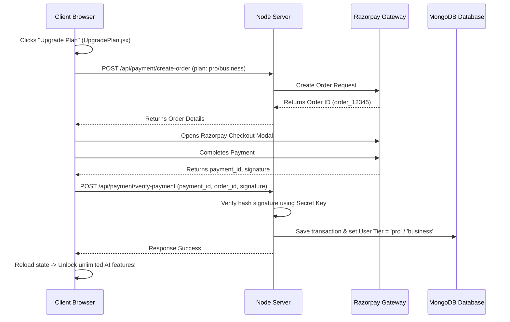

# 💳 Razorpay Subscription Integration Guide

This guide explains how to hook up **Razorpay** to dynamically count user subscriptions, update accounts, and sync the Admin Dashboard.

---

## 🗺️ How it Works



---

## 🛠️ Step 1 — Create a User Schema (Backend)
Currently, your server only has `Message` and `File` models. We need a `User` model to track plans, limits, and Razorpay subscriptions.

Create `server/models/User.js`:
```javascript
import mongoose from 'mongoose';

const userSchema = new mongoose.Schema({
  email: { type: String, required: true, unique: true },
  tier: { type: String, default: 'free' }, // 'free', 'pro', 'business'
  razorpayCustomerId: { type: String },
  subscriptionId: { type: String },
  joinedAt: { type: Date, default: Date.now },
});

export default mongoose.model('User', userSchema);
```

---

## 🛠️ Step 2 — Create the Payment Routes (Backend)
Create a new file `server/routes/payment.js` to initialize Razorpay orders and verify signatures:

```javascript
import express from 'express';
import Razorpay from 'razorpay';
import crypto from 'crypto';
import User from '../models/User.js';

const router = express.Router();

const razorpay = new Razorpay({
  key_id: process.env.RAZORPAY_KEY_ID,
  key_secret: process.env.RAZORPAY_KEY_SECRET,
});

// 1. Create a Razorpay Order
router.post('/create-order', async (req, res) => {
  try {
    const { email, amount } = req.body; // Amount in paise, e.g. 49900 for ₹499
    
    const options = {
      amount: amount, 
      currency: 'INR',
      receipt: `receipt_${Date.now()}`,
    };
    
    const order = await razorpay.orders.create(options);
    res.json({ success: true, order });
  } catch (error) {
    res.status(500).json({ success: false, error: error.message });
  }
});

// 2. Verify Razorpay Payment Signature
router.post('/verify-payment', async (req, res) => {
  try {
    const { razorpay_order_id, razorpay_payment_id, razorpay_signature, email, tier } = req.body;
    
    // Construct signature verification string
    const body = razorpay_order_id + "|" + razorpay_payment_id;
    const expectedSignature = crypto
      .createHmac('sha256', process.env.RAZORPAY_KEY_SECRET)
      .update(body.toString())
      .digest('hex');
      
    if (expectedSignature === razorpay_signature) {
      // Payment Verified! Update user status in Database
      let user = await User.findOne({ email });
      if (!user) {
        user = new User({ email });
      }
      user.tier = tier;
      await user.save();
      
      res.json({ success: true, message: 'Payment verified and subscription activated.' });
    } else {
      res.status(400).json({ success: false, message: 'Signature verification failed.' });
    }
  } catch (error) {
    res.status(500).json({ success: false, error: error.message });
  }
});

export default router;
```

Then register this route in `server/index.js`:
```javascript
import paymentRoutes from './routes/payment.js';
app.use('/api/payment', paymentRoutes);
```

---

## 🛠️ Step 3 — Load Razorpay Checkout Script (Frontend)
In `UpgradePlan.jsx`, load the Razorpay checkout overlay.

Install razorpay client script inside the React component using a custom hook or dynamic script loader:

```javascript
import React, { useState } from 'react';

export default function UpgradePlan({ setCurrentTab }) {
  const [checkoutPlan, setCheckoutPlan] = useState(null);
  const [paymentStatus, setPaymentStatus] = useState('idle');

  // Load Razorpay Script Dynamically
  const loadRazorpayScript = () => {
    return new Promise((resolve) => {
      const script = document.createElement('script');
      script.src = 'https://checkout.razorpay.com/v1/checkout.js';
      script.onload = () => resolve(true);
      script.onerror = () => resolve(false);
      document.body.appendChild(script);
    });
  };

  const handlePay = async () => {
    const isLoaded = await loadRazorpayScript();
    if (!isLoaded) {
      alert('Failed to load Razorpay SDK. Check your internet connection.');
      return;
    }

    setPaymentStatus('processing');
    const userEmail = localStorage.getItem('fic_user_email');
    const planPrice = checkoutPlan.type === 'pro' ? 49900 : 99900; // in Paise

    // 1. Create order on server
    try {
      const response = await fetch(`${import.meta.env.VITE_API_URL}/api/payment/create-order`, {
        method: 'POST',
        headers: { 'Content-Type': 'application/json' },
        body: JSON.stringify({ email: userEmail, amount: planPrice })
      });
      const data = await response.json();
      
      if (!data.success) {
        setPaymentStatus('idle');
        alert('Order creation failed.');
        return;
      }

      // 2. Configure checkout overlay options
      const options = {
        key: import.meta.env.VITE_RAZORPAY_KEY_ID, // Loaded from client/.env
        amount: data.order.amount,
        currency: data.order.currency,
        name: 'FIC AI Studio',
        description: `Subscription to ${checkoutPlan.name}`,
        order_id: data.order.id,
        handler: async function (response) {
          // 3. Verify on backend
          const verifyRes = await fetch(`${import.meta.env.VITE_API_URL}/api/payment/verify-payment`, {
            method: 'POST',
            headers: { 'Content-Type': 'application/json' },
            body: JSON.stringify({
              razorpay_order_id: response.razorpay_order_id,
              razorpay_payment_id: response.razorpay_payment_id,
              razorpay_signature: response.razorpay_signature,
              email: userEmail,
              tier: checkoutPlan.type
            })
          });
          const verifyData = await verifyRes.json();
          if (verifyData.success) {
            setPaymentStatus('success');
            localStorage.setItem('fic_user_tier', checkoutPlan.type);
            window.dispatchEvent(new Event('fic_user_login_state_changed'));
          } else {
            setPaymentStatus('idle');
            alert('Verification failed.');
          }
        },
        prefill: {
          email: userEmail,
        },
        theme: {
          color: '#7C3AED',
        },
      };

      const paymentObject = new window.Razorpay(options);
      paymentObject.open();
    } catch (err) {
      setPaymentStatus('idle');
      console.error(err);
    }
  };
  
  // ... rest of UpgradePlan component ...
}
```

---

## 🛠️ Step 4 — Dynamic Counters in Admin Dashboard (Backend)
To query counts dynamically from MongoDB cluster in `AdminDashboard.jsx`, create an endpoint:

In `server/routes/admin.js`:
```javascript
import express from 'express';
import User from '../models/User.js';
import paymentSchema from '../models/User.js'; // or your payment schemas

const router = express.Router();

router.get('/stats', async (req, res) => {
  try {
    const totalUsers = await User.countDocuments({});
    const proUsers = await User.countDocuments({ tier: 'pro' });
    const businessUsers = await User.countDocuments({ tier: 'business' });
    
    // Count revenue dynamically
    // const totalRevenue = ...
    
    res.json({
      success: true,
      stats: {
        totalUsers,
        proUsers,
        businessUsers,
        totalRevenue: 72500, // or query database transactions
        todayRevenue: 2450
      }
    });
  } catch (error) {
    res.status(500).json({ success: false, error: error.message });
  }
});

export default router;
```
Inside `AdminDashboard.jsx`, replace the static `MOCK_STATS` with a simple `fetch('/api/admin/stats')` inside a `useEffect` hook to show live numbers automatically.
